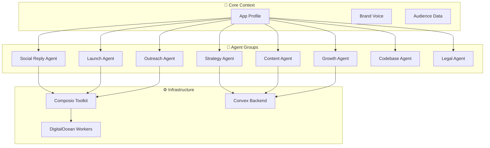
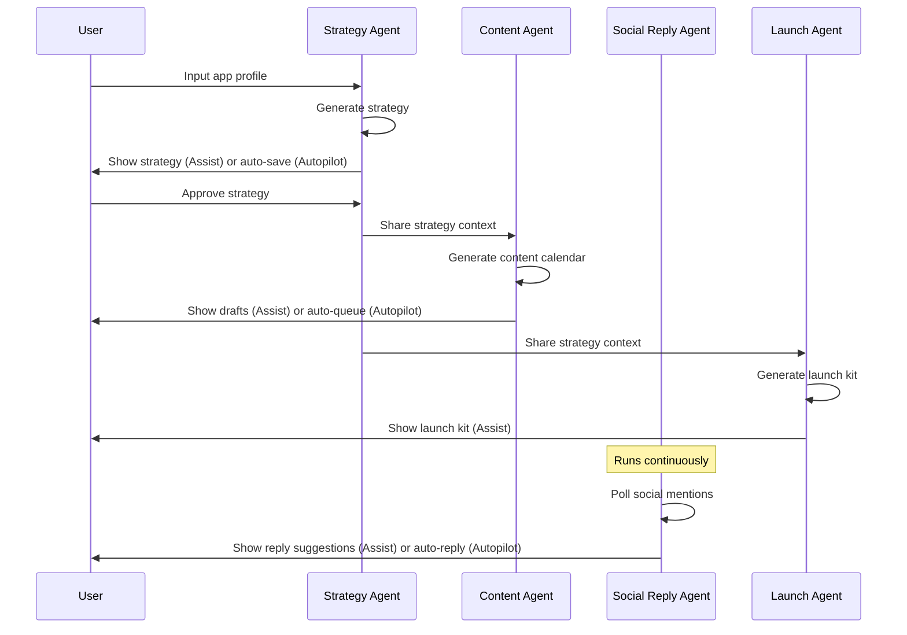

# MarketAxis AI — Agent Architecture & Brainstorming

## The Big Idea

MarketAxis AI uses **grouped AI agents**, each responsible for a domain of marketing. They share a common context (your app profile) but operate independently.

The user has **two modes via a toggle**:

| Mode | What Happens |
|------|-------------|
| 🎛️ **Assist Mode** | Agents generate suggestions; user reviews, edits, and approves before anything happens |
| 🤖 **Autopilot Mode** | Agents execute autonomously within guardrails; user gets notifications of actions taken |

---

## Agent Groups Overview



---

## Detailed Agent Specs

---

### 🧠 Agent 1: Strategy Agent (The Brain)

**Purpose:** Takes raw app info and produces a complete marketing strategy.

**Input (from user onboarding):**
- App name
- What it does (1–3 sentences)
- Target audience
- Platform (iOS / Android / Web / All)
- Region / market
- Current stage (Idea / MVP / Beta / Launched)
- Monetization model (Free / Freemium / Paid / SaaS)
- Competitor URLs (optional)

**Output:**
- Brand positioning statement
- Brand voice guidelines
- 30-day content calendar
- Launch roadmap (week-by-week)
- Community targets (subreddits, Discords, Slacks)
- Suggested pricing positioning
- Key differentiators

**How it works:**
1. User fills in app profile form
2. Agent processes through LLM with marketing-expert system prompt
3. Generates structured strategy document
4. User reviews / edits in dashboard
5. Strategy becomes shared context for all other agents

**Assist Mode:** Strategy is generated → user reviews and edits → approves
**Autopilot Mode:** Strategy is generated → auto-approved → feeds into other agents immediately

**Tech:**
- LLM call via DigitalOcean worker
- Results stored in Convex
- No external integrations needed

---

### ✍️ Agent 2: Content Agent (The Creator)

**Purpose:** Generates marketing content across all channels, using the strategy as context.

**Content Types:**

| Content | Platform | Format |
|---------|----------|--------|
| X/Twitter threads | Twitter/X | 5–10 tweet thread |
| LinkedIn posts | LinkedIn | Professional long-form |
| Reddit posts | Reddit | Community-appropriate |
| Instagram captions | Instagram | Short + hashtags |
| App Store description | iOS App Store | ASO-optimized |
| Play Store description | Google Play | ASO-optimized |
| Landing page copy | Web | Hero, features, CTA |
| Email campaigns | Email | Welcome, launch, update |
| Product Hunt description | Product Hunt | Structured pitch |
| Blog posts | Website/Medium | SEO-optimized articles |
| Changelog updates | Website | Release notes |

**How it works:**
1. Reads strategy + brand voice from shared context
2. User selects content type (or agent auto-selects based on calendar)
3. Generates draft content
4. User reviews / edits (Assist) or auto-publishes (Autopilot)

**Key features:**
- **One-click generation** — pick a type, get content instantly
- **Batch generation** — "Generate this week's content" → 10+ pieces
- **Tone matching** — adapts to brand voice from strategy
- **A/B variants** — generates 2–3 options per piece

**Assist Mode:** Content generated → user reviews in editor → approves → posts
**Autopilot Mode:** Content generated → auto-queued → auto-posted per schedule

**Tech:**
- LLM call via DigitalOcean worker
- Composio for actual posting to social platforms
- Content stored in Convex with status (draft / approved / posted)

---

### 💬 Agent 3: Social Reply Agent (The Community Manager)

**Purpose:** Monitors social mentions, suggests or auto-sends replies.

**Capabilities:**

| Feature | Description |
|---------|-------------|
| Mention monitoring | Tracks @mentions across connected platforms |
| Sentiment analysis | Flags positive, negative, neutral mentions |
| Reply suggestions | Generates contextual replies |
| Auto-reply | Responds automatically in Autopilot mode |
| Lead flagging | Identifies potential users / partners / press |
| DM management | Suggests responses to DMs |

**How it works:**
1. Polls connected social accounts via Composio
2. Detects new mentions / replies / DMs
3. Analyzes sentiment and intent
4. Generates appropriate response
5. Assist: shows suggestion → user approves
   Autopilot: auto-responds within guardrails

**Guardrails (important for Autopilot):**
- Never auto-reply to sensitive topics (politics, controversy)
- Never make promises about features
- Never share pricing unless it's public
- Flag anything ambiguous for human review
- Rate limiting: max replies per hour

**Assist Mode:** Mention detected → reply suggested → user edits/approves → sent
**Autopilot Mode:** Mention detected → auto-reply sent → user notified → can undo within 5 min

**Tech:**
- Composio for social account access (Twitter API, LinkedIn API, etc.)
- DigitalOcean worker for polling + LLM processing
- Real-time updates via Convex

---

### 🚀 Agent 4: Launch Agent (The Campaign Manager)

**Purpose:** Creates and executes launch campaigns across platforms.

**Launch Kit Outputs:**

| Asset | Description |
|-------|-------------|
| Product Hunt page | Full listing copy, tagline, images spec |
| Hacker News post | Title + comment with key info |
| IndieHackers post | Story-format launch post |
| BetaList submission | Structured submission |
| Press email template | Personalized email for journalists |
| Twitter launch thread | Announcement thread |
| LinkedIn launch post | Professional announcement |
| Reddit launch posts | Subreddit-appropriate posts |
| Email blast | Launch email to waitlist |

**How it works:**
1. Reads strategy + content templates
2. Generates complete launch kit
3. Provides platform-specific timing recommendations
4. Schedules posts (Assist) or auto-publishes (Autopilot)

**Launch Day Automation (Autopilot):**
1. 6 AM — Email blast to waitlist
2. 7 AM — Product Hunt goes live
3. 8 AM — Twitter launch thread
4. 9 AM — LinkedIn post
5. 10 AM — Hacker News post
6. Throughout day — Monitor + reply to comments on all platforms

**Assist Mode:** Launch kit generated → user reviews each piece → user triggers day-of
**Autopilot Mode:** Launch kit generated → auto-scheduled → executes on launch day

**Tech:**
- Composio for multi-platform posting
- DigitalOcean for scheduling / cron jobs
- Convex for launch state management

---

### 📧 Agent 5: Outreach Agent (The Networker)

**Purpose:** Identifies and reaches out to influencers, press, and potential partners.

**Capabilities:**

| Feature | Description |
|---------|-------------|
| Influencer discovery | Finds relevant micro-influencers in your niche |
| Email drafting | Creates personalized pitch emails |
| Follow-up sequences | Automated follow-up after X days |
| Partnership suggestions | Identifies complementary tools for co-marketing |
| Press list building | Curates journalist contacts by beat |

**How it works:**
1. Reads strategy for target audience and niche
2. Searches for relevant influencers and journalists
3. Generates personalized outreach emails
4. Tracks responses and follow-ups

**Assist Mode:** Outreach list generated → emails drafted → user reviews → user sends
**Autopilot Mode:** Outreach list generated → emails sent → follow-ups automated → user notified of responses

> **Note:** This is a **Phase 2 agent**. Build after MVP validation.

---

### 📊 Agent 6: Growth Agent (The Analyst)

**Purpose:** Analyzes performance and suggests growth improvements.

**Capabilities:**

| Feature | Description |
|---------|-------------|
| Social analytics | Engagement, reach, follower growth |
| Content performance | Which posts performed best and why |
| Growth suggestions | "Post more threads — they get 3x engagement" |
| Trend detection | Identifies trending topics in your niche |
| A/B test results | Compares content variants |
| Weekly digest | Automated summary of marketing performance |

**How it works:**
1. Pulls analytics from connected platforms via Composio
2. Analyzes patterns using LLM
3. Generates actionable recommendations
4. Updates strategy agent with learnings

**Assist Mode:** Weekly report generated → recommendations shown → user decides
**Autopilot Mode:** Recommendations auto-applied → strategy auto-updated → user notified

> **Note:** This is a **Phase 2/3 agent**. Start simple with basic analytics.

---

### 🔗 Agent 7: Codebase Agent (The Technical Reader)

**Purpose:** Connects to a GitHub repository, reads and understands the codebase, and provides deep product context to all other agents.

**Why this matters:**
Most marketing tools ask you to *describe* your product. MarketAxis AI *reads your code* and understands it — features, tech stack, API endpoints, README, package.json, changelogs. This makes every other agent dramatically better.

**Capabilities:**

| Feature | Description |
|---------|-------------|
| Repo analysis | Reads README, package.json, file structure |
| Feature extraction | Identifies key features from code |
| Tech stack detection | Knows your frameworks, languages, dependencies |
| Changelog parsing | Reads CHANGELOG.md for release notes content |
| API documentation | Extracts endpoint info for marketing copy |
| Competitive context | Compares your repo to competitor repos |

**How it works:**
1. User connects GitHub via Composio OAuth
2. Agent clones/reads repository structure
3. Analyzes README, package.json, source files
4. Extracts structured product context
5. Feeds enriched context to Strategy, Content, and Legal agents

**Assist Mode:** Repo analyzed → insights shown → user confirms accuracy → context saved
**Autopilot Mode:** Repo analyzed → auto-saved to context → other agents auto-updated

**Tech:**
- Composio GitHub integration for repo access
- LLM for code understanding and feature extraction
- Results stored in Convex as enriched app context

---

### ⚖️ Agent 8: Legal Agent (The Compliance Advisor)

**Purpose:** Analyzes the codebase and app profile to determine what legal documents are needed, then generates them.

**Why this matters:**
Most indie devs ship without proper legal docs. One lawsuit or data breach and they're done. MarketAxis AI auto-detects what you need based on what your app actually does.

**Capabilities:**

| Feature | Description |
|---------|-------------|
| Document detection | Analyzes codebase to determine required legal docs |
| Privacy Policy generation | Based on data collection patterns in code |
| Terms of Service generation | Based on app type and monetization |
| Cookie Policy | If web app with tracking |
| GDPR compliance check | For EU-targeted apps |
| Data Processing Agreement | For B2B SaaS apps |
| Refund Policy | For paid apps |
| EULA | For downloadable software |
| Disclaimer templates | For AI-powered or financial apps |

**How it detects what you need:**
1. Reads codebase via Codebase Agent context
2. Detects: auth (user data), payments (Stripe/billing), analytics (tracking), file uploads (user content), API keys (third-party services)
3. Cross-references with region (GDPR, CCPA, etc.)
4. Generates document recommendations + severity
5. Creates draft legal documents

**Output stored in Resources:**
All generated legal documents are saved in the **Resources** section of the dashboard — a dedicated document vault where users can view, edit, download, and manage all their generated documents.

**Assist Mode:** Analysis shown → documents recommended → user selects → drafts generated → user reviews
**Autopilot Mode:** All recommended documents auto-generated → user notified → stored in Resources

**⚠️ Disclaimer:** Generated documents are templates and starting points. Users should have a lawyer review critical legal documents.

**Tech:**
- Depends on Codebase Agent output
- LLM with legal-expert system prompt
- Documents stored in Convex `resources` table

---

## The Toggle: Assist vs. Autopilot

### How It Works in the UI

```
┌─────────────────────────────────────────┐
│  Marketing Mode                         │
│                                         │
│  🎛️  Assist    ◉──────────○  🤖 Autopilot │
│                                         │
│  Current: Assist Mode                   │
│  "You review everything before it goes  │
│   out. Full control."                   │
│                                         │
│  Autopilot unlocks:                     │
│  ✓ Auto-posting on schedule             │
│  ✓ Auto-reply to socials               │
│  ✓ Auto-generated weekly content        │
│  ✓ Auto-follow-up on outreach           │
│                                         │
│  Guardrails always active:              │
│  • No controversial topics              │
│  • No feature promises                  │
│  • Undo window for all actions          │
│  • Daily summary of actions taken       │
└─────────────────────────────────────────┘
```

### Per-Agent Toggle (Advanced)

Power users can toggle per agent:

| Agent | Assist | Autopilot |
|-------|--------|-----------|
| Strategy | ✅ | ❌ (always review) |
| Content | ✅ | ✅ |
| Social Reply | ✅ | ✅ |
| Launch | ✅ | ✅ |
| Outreach | ✅ | ✅ |
| Growth | ✅ | ✅ |

**Strategy Agent is always Assist-first** — it sets the foundation. Bad strategy = bad everything.

---

## Agent Communication Flow



---

## MVP Agent Priority

| Priority | Agent | MVP? | Effort |
|----------|-------|------|--------|
| 🥇 1 | Strategy Agent | ✅ Yes | Medium |
| 🥈 2 | Content Agent | ✅ Yes | Medium |
| 🥉 3 | Launch Agent | ✅ Yes | Low-Medium |
| 4 | Codebase Agent | ✅ Yes | Medium |
| 5 | Legal Agent | ✅ Yes | Medium |
| 6 | Social Reply Agent | ⬜ Phase 2 | High |
| 7 | Outreach Agent | ⬜ Phase 2 | Medium |
| 8 | Growth Agent | ⬜ Phase 3 | High |

**MVP = Strategy + Content + Launch Kit + Codebase + Legal**. The codebase reading and legal generation are massive differentiators.

---

## Shared Context Layer

All agents share a **Brand Context** object stored in Convex:

```
Brand Context {
  appName: string
  description: string
  targetAudience: string
  platforms: ["web", "ios", "android"]
  region: string
  stage: "idea" | "mvp" | "beta" | "launched"
  monetization: string
  competitors: string[]
  positioningStatement: string
  brandVoice: {
    tone: string
    personality: string
    doList: string[]
    dontList: string[]
  }
  strategy: {
    contentCalendar: ContentPlan[]
    launchRoadmap: LaunchPhase[]
    targetCommunities: Community[]
  }
  generatedContent: Content[]
  socialAccounts: SocialAccount[]
  analytics: AnalyticsData
}
```

This shared context is what makes MarketAxis AI **product-aware** instead of generic.
